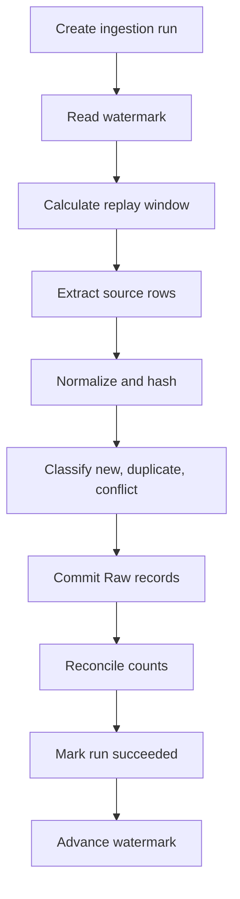

# Incremental Ingestion Design and Database Test Plan

This document defines the ingestion behavior for the Subscription Lakehouse Lab. It summarizes how the project uses watermarks, lookback windows, hashes, ingestion metadata, historical Raw tables, retries, and database-based tests.

The SQL examples use PostgreSQL syntax. Adapt types and functions if another source database is used.

## 1. Design principles

1. Source time and platform time are different facts.
2. A watermark controls what the source extractor reads next.
3. A lookback window helps discover records that appear behind an imprecise cursor.
4. A hash classifies an already extracted record as unchanged or changed.
5. An ingestion ID groups records written by one logical ingestion batch.
6. Raw preserves received source history; Core interprets that history.
7. Watermarks advance only after the destination commit succeeds.
8. Every ingestion must be safe to retry.

These mechanisms solve different problems and should not be treated as interchangeable.

## 2. Time semantics

| Column | Owner | Meaning |
| --- | --- | --- |
| `event_time` | Business/source | When an event became true in the business domain |
| `recorded_at` | Source | When the source recorded or published an event |
| `created_at` | Source | When a source entity was created |
| `updated_at` | Source | When a source entity was last modified |
| `_ingested_at` | Data platform | When the record first entered the platform |
| `_processed_at` | Data platform | When a downstream materialization processed the record |
| `_model_updated_at` | Data platform | When a consumption model was last built |

Never overwrite an earlier timestamp when a record moves to another layer.

For example:

```text
event_time      = 2026-08-28 15:00:00Z
recorded_at     = 2026-08-29 09:00:00Z
_ingested_at    = 2026-08-29 09:05:00Z
_processed_at   = 2026-08-29 09:10:00Z
```

These values allow the platform to calculate source delay, ingestion delay, processing delay, and total data-availability delay.

## 3. Raw history policy

Raw tables are historical for this project.

| Source object | Raw behavior | Main identity |
| --- | --- | --- |
| Subscription events | Append immutable events | `event_id` |
| Customers | Append newly observed versions | `customer_id + _source_payload_hash` |
| Plans | Append newly observed versions | `plan_id + _source_payload_hash` |

An entity business key is not necessarily unique in historical Raw. Customer `1001` may have several received versions.

Core models are responsible for:

- choosing the latest known state;
- creating SCD Type 2 validity intervals;
- identifying business-significant changes;
- exposing current-state and historical views.

## 4. Choosing an incremental cursor

Use the most reliable cursor the source provides.

| Source capability | Preferred cursor | Regular time lookback |
| --- | --- | --- |
| Database CDC | LSN/binlog position | Usually unnecessary |
| Kafka/Redpanda | Partition offsets and checkpoints | Not applicable |
| Monotonic source sequence | Sequence number | Usually unnecessary |
| API pagination cursor | Source cursor/token | Usually unnecessary |
| Precise `updated_at` | Timestamp plus primary-key tie-breaker | Often defensive |
| Date-only `updated_at` | Replay open dates plus hash comparison | Strongly recommended |
| Date-only `recorded_at` | Replay open dates plus event-ID deduplication | Strongly recommended |
| Immutable files | Object path plus ETag/checksum | Usually unnecessary |
| File modification timestamp | Timestamp plus file manifest | Recommended |
| Full snapshot | No incremental cursor | Not applicable |

For this database test, assume:

```text
customers.updated_at             DATE
plans.updated_at                 DATE
subscription_events.recorded_at  DATE
```

These date-only columns cannot precisely order micro-batches within a day.

## 5. Compound cursors

When a precise timestamp is available, use the primary key as a deterministic tie-breaker:

```sql
SELECT *
FROM source.customers
WHERE updated_at > :last_updated_at
   OR (
       updated_at = :last_updated_at
       AND customer_id > :last_customer_id
   )
ORDER BY updated_at, customer_id;
```

The stored cursor is:

```text
(updated_at, customer_id)
```

This prevents records with equal timestamps from being skipped during pagination.

A compound cursor does not fix a date-only source. If customer `1001` changes after the cursor has already passed `(2026-08-30, 1001)`, the source still exposes the same ordered value. For date-only sources, replay the open date instead.

## 6. Lookback windows

A lookback window moves the extraction boundary backward:

```sql
SELECT *
FROM source.customers
WHERE updated_at >= :replay_from_date;
```

For a two-day lookback:

```text
replay_from_date = current_date - 2 days
```

The extractor intentionally rereads overlapping source data. Destination idempotency makes the overlap safe.

### What lookback protects against

- Date-only source timestamps
- Late-arriving or backdated records
- Records around midnight and timezone boundaries
- Long source transactions
- API synchronization delays
- Short pipeline outages
- Timestamp precision differences

### What lookback does not solve

- Changes older than the configured window
- Intermediate states never exposed between polling runs
- Incorrect source data with no key or ordering
- Unlimited source backdating

Use periodic reconciliation or explicit backfills for older data.

### Lookback is not universal

Do not add a time lookback when an exact CDC position, Kafka offset, API token, immutable file identity, or suitable snapshot ID already provides precise progress tracking.

## 7. Hashing

Use SHA-256 over a canonical, normalized representation.

### Source payload hash

`_source_payload_hash` includes every normalized source-provided field but excludes data-platform metadata.

Use it to:

- identify exact source retries;
- identify new observed entity versions;
- detect conflicting events;
- audit the payload received from the source.

Exclude:

```text
_ingestion_id
_attempt_id
_ingested_at
_processed_at
_source_file
```

Otherwise every retry would produce a different hash.

### Business hash

`_business_hash` is created in Core from attributes that should create a business-history version.

For customers, it might contain:

```text
customer_name
email
country
state
city
customer_status
```

It normally excludes operational fields such as `updated_at`. If only `updated_at` changes, Raw can preserve a new source payload while Core avoids creating an unnecessary SCD2 version.

### Canonicalization requirements

Before hashing:

- sort object keys;
- normalize timestamps to UTC;
- normalize decimals to fixed precision;
- define how missing fields and nulls are treated;
- define whitespace and case policies;
- use stable UTF-8 serialization.

Example Python:

```python
import hashlib
import json
from typing import Any


def payload_hash(payload: dict[str, Any]) -> str:
    canonical = json.dumps(
        payload,
        sort_keys=True,
        separators=(",", ":"),
        ensure_ascii=False,
    )
    return hashlib.sha256(canonical.encode("utf-8")).hexdigest()
```

Hashing raw JSON bytes without canonicalization makes property order and formatting appear as data changes.

## 8. Event deduplication and conflict detection

For events:

```text
event_id             = identity
_source_payload_hash = payload verification
```

| Existing event ID | Hash matches | Classification | Action |
| --- | --- | --- | --- |
| No | N/A | New event | Append |
| Yes | Yes | Exact retry | Ignore |
| Yes | No | Conflicting payload | Quarantine |

Do not silently overwrite a Raw event when the same event ID arrives with different content.

Hash alone is not the best event identity because two legitimate events can have identical business fields. A source-provided immutable `event_id` carries stronger semantics.

## 9. Mutable entity change detection

Customers and plans keep the same business key while their content changes.

For each extracted customer:

1. Normalize the source payload.
2. Calculate `_source_payload_hash`.
3. Check whether the same `customer_id + hash` already exists in Raw.
4. Ignore an identical observation.
5. Append a new Raw version when the hash differs.

With date-only `updated_at`, content hashing detects a changed state even when the source date has not changed.

The platform cannot recover an intermediate state that changed and disappeared between two polls. CDC or a source audit log is required for complete change history.

## 10. Ingestion metadata

Recommended Raw metadata:

| Column | Purpose |
| --- | --- |
| `_ingestion_id` | Groups records from one logical source window |
| `_attempt_id` | Identifies an individual retry attempt |
| `_ingested_at` | Records platform arrival time |
| `_source_system` | Identifies the source application/database |
| `_source_object` | Identifies the source table, endpoint, or topic |
| `_source_file` | Identifies a source file when applicable |
| `_source_payload_hash` | Verifies normalized source content |

### Ingestion ID

Generate one ID when a logical ingestion starts and assign it to all records in that batch.

Example:

```text
customers_20260830T100000Z_4af218b1
```

The ID can combine:

- pipeline name;
- UTC start timestamp;
- UUID/ULID suffix.

If the same logical batch is retried, keep the ingestion ID and increment or regenerate `_attempt_id`.

`_ingestion_id` is useful for:

- row-count reconciliation;
- batch-level lineage;
- troubleshooting;
- retry detection;
- selecting one Raw batch for downstream processing.

It is not a source watermark.

## 11. Control tables

Create a control schema separate from business data.

```sql
CREATE SCHEMA IF NOT EXISTS control;

CREATE TABLE IF NOT EXISTS control.ingestion_watermarks (
    pipeline_name          TEXT PRIMARY KEY,
    source_object          TEXT NOT NULL,
    cursor_type            TEXT NOT NULL,
    cursor_value           TEXT,
    tie_breaker_value      TEXT,
    lookback_days          INTEGER NOT NULL DEFAULT 0,
    last_ingestion_id      TEXT,
    last_succeeded_at      TIMESTAMPTZ,
    updated_at             TIMESTAMPTZ NOT NULL DEFAULT CURRENT_TIMESTAMP
);

CREATE TABLE IF NOT EXISTS control.ingestion_runs (
    ingestion_id           TEXT PRIMARY KEY,
    pipeline_name          TEXT NOT NULL,
    source_object          TEXT NOT NULL,
    attempt_number         INTEGER NOT NULL DEFAULT 1,
    window_start           TEXT,
    window_end             TEXT,
    started_at             TIMESTAMPTZ NOT NULL,
    finished_at            TIMESTAMPTZ,
    extracted_count        BIGINT,
    written_count          BIGINT,
    duplicate_count        BIGINT,
    rejected_count         BIGINT,
    status                 TEXT NOT NULL,
    error_message          TEXT
);
```

Suggested statuses:

```text
running
succeeded
failed
```

Only update `control.ingestion_watermarks` after the Raw destination commit succeeds.

## 12. Example Raw tables

```sql
CREATE SCHEMA IF NOT EXISTS raw;

CREATE TABLE IF NOT EXISTS raw.customers (
    customer_id            BIGINT NOT NULL,
    customer_name          TEXT NOT NULL,
    email                  TEXT NOT NULL,
    country                TEXT NOT NULL,
    state                  TEXT NOT NULL,
    city                   TEXT NOT NULL,
    customer_status        TEXT NOT NULL,
    created_at             DATE NOT NULL,
    updated_at             DATE NOT NULL,
    _source_payload_hash   TEXT NOT NULL,
    _ingestion_id          TEXT NOT NULL,
    _attempt_id            TEXT NOT NULL,
    _ingested_at           TIMESTAMPTZ NOT NULL,
    _source_system         TEXT NOT NULL,
    _source_object         TEXT NOT NULL,
    UNIQUE (customer_id, _source_payload_hash)
);

CREATE TABLE IF NOT EXISTS raw.plans (
    plan_id                BIGINT NOT NULL,
    plan_name              TEXT NOT NULL,
    plan_description       TEXT,
    billing_cycle          TEXT NOT NULL,
    price                  NUMERIC(12, 2) NOT NULL,
    currency               TEXT NOT NULL,
    max_users              INTEGER NOT NULL,
    plan_status            TEXT NOT NULL,
    created_at             DATE NOT NULL,
    updated_at             DATE NOT NULL,
    _source_payload_hash   TEXT NOT NULL,
    _ingestion_id          TEXT NOT NULL,
    _attempt_id            TEXT NOT NULL,
    _ingested_at           TIMESTAMPTZ NOT NULL,
    _source_system         TEXT NOT NULL,
    _source_object         TEXT NOT NULL,
    UNIQUE (plan_id, _source_payload_hash)
);

CREATE TABLE IF NOT EXISTS raw.subscription_events (
    event_id               TEXT PRIMARY KEY,
    event_type             TEXT NOT NULL,
    customer_id            BIGINT NOT NULL,
    subscription_id        BIGINT NOT NULL,
    plan_id                BIGINT NOT NULL,
    amount                 NUMERIC(12, 2) NOT NULL,
    currency               TEXT NOT NULL,
    status                 TEXT NOT NULL,
    event_time             TIMESTAMPTZ NOT NULL,
    recorded_at            DATE NOT NULL,
    _source_payload_hash   TEXT NOT NULL,
    _ingestion_id          TEXT NOT NULL,
    _attempt_id            TEXT NOT NULL,
    _ingested_at           TIMESTAMPTZ NOT NULL,
    _source_system         TEXT NOT NULL,
    _source_object         TEXT NOT NULL
);

CREATE TABLE IF NOT EXISTS raw.subscription_event_conflicts (
    conflict_id            BIGSERIAL PRIMARY KEY,
    event_id               TEXT NOT NULL,
    existing_hash          TEXT NOT NULL,
    incoming_hash          TEXT NOT NULL,
    incoming_payload       JSONB NOT NULL,
    _ingestion_id          TEXT NOT NULL,
    detected_at            TIMESTAMPTZ NOT NULL DEFAULT CURRENT_TIMESTAMP
);
```

The PostgreSQL uniqueness constraints make the test behavior explicit. Iceberg does not enforce these database constraints, so the production Iceberg ingestion logic must implement the same checks.

## 13. Ingestion workflow



If any step before the Raw commit fails, mark the run failed and do not advance the watermark.

If the Raw commit succeeds but the watermark update fails, retrying may extract the same source rows. Hashing, event IDs, and idempotent writes must make that retry safe.

## 14. Date-only micro-batch strategy

For customers and plans:

```sql
SELECT *
FROM source.customers
WHERE updated_at >= :current_date - :lookback_days;
```

For events:

```sql
SELECT *
FROM source.subscription_events
WHERE recorded_at >= :current_date - :lookback_days;
```

Recommended initial lookback:

```text
2 days
```

This is a learning default, not a universal production value. Choose a production interval from observed lateness, source behavior, data volume, and recovery requirements.

## 15. Database test scenarios

### Test 1 — Initial ingestion

1. Insert the initial customers, plans, and events into the source schema.
2. Run ingestion.
3. Verify expected Raw counts.
4. Verify every record has ingestion metadata.
5. Verify the run is marked `succeeded`.
6. Verify the watermark advances.

### Test 2 — Exact retry

1. Run the same source window again.
2. Verify customer and plan versions are not duplicated.
3. Verify events with existing IDs and matching hashes are ignored.
4. Verify duplicate counts are recorded.

### Test 3 — Entity change with the same date

1. Change customer `1001.city`.
2. Keep `updated_at` on the same date.
3. Run another micro-batch.
4. Verify a new Raw customer version is appended because the hash changed.

### Test 4 — Operational timestamp change only

1. Change only the source `updated_at`.
2. Verify `_source_payload_hash` changes in Raw.
3. Later, verify the Core business hash does not create a new SCD2 version when business attributes are unchanged.

### Test 5 — Late event inside lookback

1. Insert a new event today with yesterday's `recorded_at`.
2. Run ingestion with a two-day lookback.
3. Verify the event is discovered and appended.

### Test 6 — Event conflict

1. Send an existing `event_id` with a modified amount or status.
2. Verify Raw is not overwritten.
3. Verify the incoming payload is written to the conflict table.
4. Verify the rejected/conflict count is visible in the run record.

### Test 7 — Failed destination write

1. Simulate a Raw write failure.
2. Verify the run is marked `failed`.
3. Verify the watermark does not advance.
4. Retry and verify the final result has no duplicate business records.

### Test 8 — Record older than lookback

1. Insert a new source event whose `recorded_at` is older than two days.
2. Verify the normal micro-batch does not discover it.
3. Execute an explicit backfill or reconciliation.
4. Document that lookback is bounded protection.

### Test 9 — Unobservable intermediate state

1. Change a customer twice between ingestion polls.
2. Run ingestion only after the second change.
3. Verify only the latest observed state reaches Raw.
4. Document that complete history requires CDC or a source audit log.

## 16. Acceptance criteria

- [ ] Watermark and ingestion ID are modeled as separate concepts.
- [ ] Watermarks advance only after successful Raw commits.
- [ ] Date-only sources are read using an inclusive lookback.
- [ ] Exact retries do not create duplicate Raw versions.
- [ ] Customer and plan changes with the same source date are detected by hash.
- [ ] New event IDs are appended.
- [ ] Identical event retries are ignored.
- [ ] Conflicting event payloads are quarantined.
- [ ] Platform metadata is excluded from source payload hashes.
- [ ] Source and platform timestamps retain distinct meanings.
- [ ] Failed runs do not advance source progress.
- [ ] An explicit reconciliation/backfill path exists for data older than the lookback.

## 17. Recommended implementation order

1. Create PostgreSQL source, control, Raw, and conflict tables.
2. Load the small source fixtures.
3. Implement canonical payload hashing.
4. Implement ingestion-run creation and status updates.
5. Implement date-based extraction with a two-day lookback.
6. Implement entity version detection.
7. Implement event ID deduplication and conflict quarantine.
8. Implement watermark advancement after successful writes.
9. Automate the database test scenarios.
10. Port the proven behavior from PostgreSQL Raw tables to Iceberg.

The database test layer should validate semantics before distributed infrastructure is introduced.
